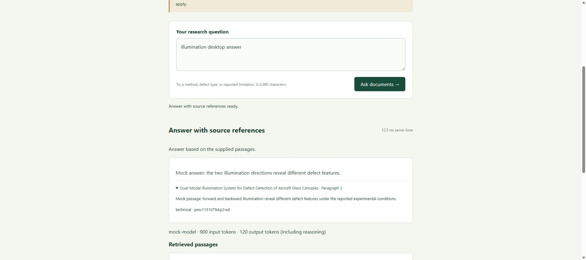
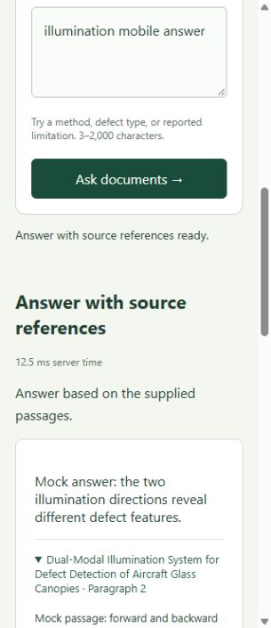
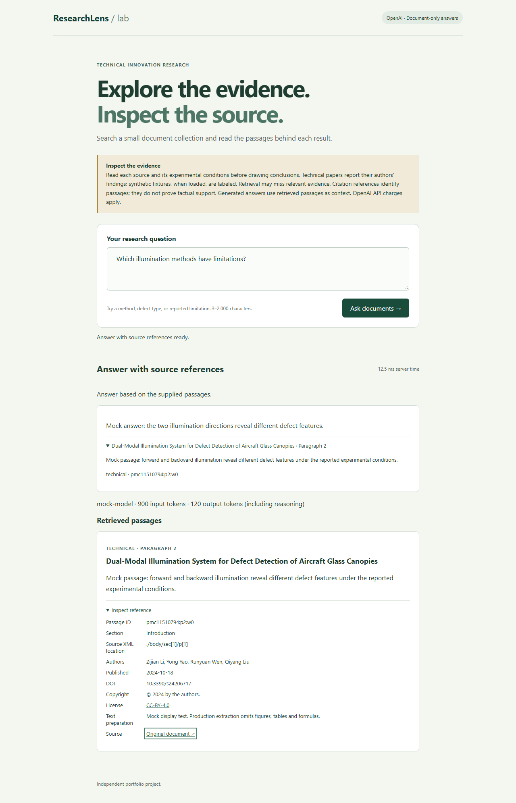
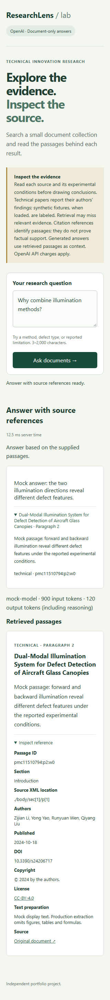

# Frontend verification — 2026-10-01

This work starts from `origin/main` at `3b7048c` on a separate
`frontend-verification` branch/worktree. It does not incorporate PR #8 or PR #9.
Backend APIs, retrieval, evaluation data, corpus files and model configuration are unchanged.
The fixture text in `testing/fixtures.ts` is explicitly mocked presentation data,
with the current `Answer`/`SearchHit` fields from `backend/researchlens/models.py`.
It is not scientific evidence or an evaluation dataset.

## Automated checks

Run these commands from `frontend` (Node 24 is the CI/recommended runtime):

```sh
rtk npm ci
rtk npm run check
rtk npm test
rtk npm run build
rtk npm run test:smoke:install
rtk npm run test:smoke
```

If RTK is unavailable, remove the `rtk` prefix. Linux CI installs browser system
dependencies with `npx playwright install --with-deps chromium` instead of the
browser-only installation command. Smoke tests own port 4300; stop other servers
on that port first. Dependencies and the browser need an initial download;
test execution needs no API key, backend server or paid API call.

| Check | Verified locally |
| --- | --- |
| Angular's `@angular/build:unit-test` / Vitest + jsdom | 21 component tests passed |
| Playwright / Chromium | 3 smoke tests passed |
| `npm run check` | Smoke/fixture TypeScript and formatting passed |
| `npm run build` | Production build passed, within Angular budgets |
| Existing backend checks, from repository root | `uv run pytest -q`: 33 passed; `uv run ruff check backend` and `uv run ruff format --check backend` passed |

The [GitHub Actions push run](https://github.com/Timerk/ResearchLens/actions/runs/36869204683)
also passed both jobs, including the frontend suite/build on Linux with Node 24.

Local runs used Windows, Node 22.22.0 and Python 3.13.14. The initial dependency
addition hit an npm 10 resolver error; using the repository-declared npm 11.17.0
resolved it. A subsequent clean `npm ci` succeeded. Backend tests emit an existing
Starlette TestClient/httpx deprecation warning. GitHub Actions uses Node 24 and
uploads browser reports and screenshots as `frontend-browser-results` for seven days.

Component tests exercise empty/whitespace/short/oversize questions, trimming and
the 2,000-character boundary, POST payloads, loading and duplicate prevention,
clearing stale answers/errors, health failure/recovery, successful answers,
section-to-citation association, source/license links and attribution,
technical and synthetic passages, plain-text rendering, local preview, no matches,
insufficient evidence, HTTP 429/503/504 errors, structured 422 detail, network
failure and retry. Native disclosure expansion is checked in Chromium rather
than relying on jsdom to emulate it.

Chromium smoke tests check Tab order through brand, question, submit, citation,
reference, license and source; Enter/Space submission and disclosure expansion;
focus retention during loading/retry; computed focus outlines; accessible
question naming; concise live status text and alert recovery; correct source
link attributes; and 320px preview, no-matches and answered layouts. Long XML
metadata is exercised with an explicit no-horizontal-overflow assertion.

## T3 collaborative browser inspection

The running Angular UI was opened at `http://localhost:4300` using the offline
mock server (`npm run start:mock`). Actual T3 keyboard interactions traversed the
brand, question and submit controls, submitted with Enter, retained button focus
during loading/completion, and expanded both citation/reference disclosures
using Enter/Space. DOM inspection confirmed the question label and descriptions,
read-only loading input, `aria-disabled` button, `aria-busy` result region, loading
and completion status text, source/license URLs and `noopener noreferrer` links.
At 320×740, T3 input interaction confirmed whitespace-aware validation,
`aria-invalid`, the disabled submit button and no initial horizontal overflow.

Full visual inspection **in T3** was blocked. `preview_snapshot` repeatedly returned
`PreviewAutomationExecutionError` with “Preview automation snapshot failed on client
preview-4adae1015e4c06e49eb804f6379bf250,” including after reopening/resizing and
opening another tab. The tool reported `visible: false`; `document.hasFocus()`
was false, so T3 could not verify rendered focus rings. During mobile submission,
the host disconnected and returned “No preview automation host is available” for
environment `41b52f2c-0c97-49a0-bba1-d74c7cd8c208`, with an instruction not to retry.
T3 mobile result inspection and T3 screenshot capture therefore remain incomplete.
The focus-ring and mobile-result evidence above comes from Chromium smoke tests.

## Normal Chrome follow-up inspection

At the user's request, the installed Chrome browser was connected through its
browser extension and used against the same offline mock server on port 4300.
This was an actual normal Chrome session, separate from both T3's preview and
the headless Chromium smoke suite. No backend or provider calls were made.

Keyboard navigation showed visible 2px green focus outlines on the brand,
question, submit button, citation summary, reference summary, license link and
source link. Enter submitted the question; the button retained focus during the
eight-second mocked request and after completion. The read-only question,
`aria-disabled` submit control, busy result region and concise loading/completion
status text were confirmed. Repeated Enter/Space while pending did not restart
the visible workflow; exact duplicate-request counts are asserted by the existing
automated smoke test. Enter/Space expanded the citation/reference disclosures.
Source/license destinations and new-tab/security attributes were confirmed.

Chrome interactions also checked local preview, no matches, insufficient evidence,
the API timeout alert and a successful retry that cleared the alert. Screenshots
were visually inspected for the answer, loading, error, validation, preview,
no-matches and expanded reference layouts. The accessible question name,
description, validation state, result status and alert were inspected in the DOM;
screen-reader speech was not tested. No warning/error entries were reported by
the tab's captured console log during the checks.

At a 320×740 viewport, whitespace-aware validation disabled submission, the
answer/citation text wrapped, and expanded metadata stacked without horizontal
overflow (305px content width after the vertical scrollbar). At 390×844, preview
and no-matches states also fit without horizontal overflow (375px content width).
The temporary viewport override was reset afterward. No additional frontend
defects were found; this follow-up changes documentation and evidence only.

Chrome viewport screenshots succeeded. Full-page captures timed out on
`Page.captureScreenshot`, and synthesized scrolling timed out on
`Input.synthesizeScrollGesture`. Regular control interaction and locator scrolling
still allowed viewport inspection/capture. The earlier automated full-page PNGs
are retained alongside these Chrome viewport JPEGs.





Additional Chrome evidence: [loading](screenshots/chrome-desktop-loading.jpg),
[API error](screenshots/chrome-desktop-error.jpg),
[desktop no matches](screenshots/chrome-desktop-no-matches.jpg),
[320px validation](screenshots/chrome-mobile-validation.jpg),
[320px expanded reference](screenshots/chrome-mobile-reference.jpg),
[390px preview](screenshots/chrome-mobile-preview.jpg), and
[390px no matches](screenshots/chrome-mobile-no-matches.jpg).

## Captured visual evidence

Playwright captured desktop initial, loading, expanded answer, API error and
insufficient-evidence states, plus mobile expanded preview, no matches and
expanded answer. Those PNGs were opened and visually inspected locally; the
existing palette/layout remains intact and the source metadata wraps at 320px.
These are captured browser screenshots, not generated mockups or T3 snapshots.
Two representative screenshots are retained here; all states are produced under
`test-results/` and included in the CI artifact. These are inspection
artifacts, not pixel-diff screenshot assertions.





## Remaining limits

- No real provider calls, retrieval-quality assessment or factual-support evaluation
  was performed. Valid citation IDs only identify passages; people must assess support.
- Backend messages are displayed as returned. Current main's local preview/no-matches
  wording mentions lexical search; the frontend's own notice makes no assumption
  about future retrieval methods. Backend wording is outside this change.
- This checks Chromium CSS viewports, not Safari/Firefox, mobile device input,
  screen-reader announcements, or a full accessibility conformance audit.
- External source pages were not opened; tests check the link destinations and
  new-tab/security attributes without introducing external network dependencies.
- T3-specific screenshot capture remains blocked by its preview host. The equivalent
  rendered focus and mobile result checks were completed in normal Chrome above;
  Chrome's full-page capture and synthesized-scroll tooling limits are recorded there.

## Post-cleanup verification — 2026-10-06

After updating Angular to 21.2.25, adding MIT licensing and enforcing frontend LF
line endings, a clean install with Node 24.21.0 and npm 11.17.0 passed the formatting
and TypeScript check, 21 component tests, the production build and all three
Chromium smoke tests. Python 3.13.16 passed all 33 backend tests and both Ruff checks.
The frontend lockfile audit reported zero known vulnerabilities.

The updated app was also run and visually inspected in normal Chrome. FastAPI
served the technical corpus in local preview mode through Angular's development
proxy. A real canopy-lighting question returned four passages; expanded references
displayed section/XML locations, authors, publication date, copyright, license and
source links. A nonsense query displayed the no-match state, and a one-character
question displayed validation feedback with submission disabled. Keyboard
submission worked. The real-backend session had no browser console errors.

Desktop and 390px/320px mobile layouts were inspected, including expanded source
metadata. Neither mobile width had horizontal overflow. The offline mock server
was used separately to inspect generated-answer sections, expandable citations,
eight-second loading feedback, a 504 error alert, successful keyboard retry and
insufficient-evidence feedback. These mock responses are presentation fixtures;
this check made no paid OpenAI requests and does not establish answer quality.

Representative screenshots from this check:

- [Desktop reference from the real local backend](screenshots/chrome-post-cleanup-desktop-reference.jpg).
- [390px generated-answer layout using mock responses](screenshots/chrome-post-cleanup-mobile-answer.jpg).

The temporary viewport override was reset and the verification servers were stopped.
